[](https://git.io/typing-svg)
# 


<div align="center">

[](https://scoreiqv2.netlify.app/)
[](https://scoreiqai-production.up.railway.app)
[](LICENSE)
[](https://python.org)
[](https://fastapi.tiangolo.com)

**Alternative credit scoring for 190M+ Indians invisible to CIBIL.**

*CIBIL sees your past. ScoreIQ sees your future.*

</div>

---

## 🧠 What is ScoreIQ?

ScoreIQ is an **AI-powered alternative credit scoring platform** built for India's financially active but credit-invisible population — gig workers, fresh graduates, self-employed professionals, and rural workers who have never taken a formal loan.

Traditional bureaus like CIBIL require loan repayment history to generate a score. If you've never borrowed, you're invisible — regardless of your income, savings, or assets. **ScoreIQ breaks this trap.**

Instead of looking at past borrowing, ScoreIQ analyses:

| Signal | What we measure |
|--------|-----------------|
| 💰 Income & Expenses | Monthly cash flow, savings rate, expense discipline |
| 🏦 Banking Behaviour | Balance patterns, salary credits, bounces, EMI outflow |
| 🏠 Assets | Real estate, gold, FDs, mutual funds — net equity after loans |
| ⚖️ Liabilities | Home loan, vehicle loan, personal loan, credit card dues |
| 📋 Credit History | Missed payments, existing loan count, employment stability |

---

## 📊 The Problem



> **190 million** Indians have no credit score.
> **40%** of loan applications are rejected for no credit history.
> **₹18 Lakh Crore** credit gap for underserved borrowers.

### Who falls through the cracks?

- 🛵 **Gig workers** — Swiggy, Ola, Uber drivers earning ₹40k+/month but no payslip
- 🎓 **Fresh graduates** — 6 months into first job, zero loan history
- 🏪 **Self-employed** — shop owners with ₹20L in assets but no salary statement
- 🌾 **Rural workers** — seasonal income, good cash flow, no formal banking trail

---

## ✅ The Solution

ScoreIQ replaces the loan-history requirement with a holistic AI analysis of your financial life:

```
User Form ──┐
Bank PDF  ──┤──→ AI Credit Engine ──→ Score (300–850)
Setu AA   ──┤                    ──→ Risk Band
Assets    ──┤                    ──→ Plain-English Explanation
Liabilities─┘                   ──→ 5 Improvement Tips
```

### Key advantages

- ✦ **No loan history needed** — scores first-time borrowers instantly
- ✦ **AI analyses all signals together** — not just one metric in isolation
- ✦ **Fairer for gig workers** — cash flow and assets matter more than salary slips
- ✦ **Fully explainable** — every score comes with a reason and a roadmap
- ✦ **Real-time verified data** — via Setu Account Aggregator (RBI-approved)

---

## ⚙️ Tech Stack

| Layer | Technology | Purpose |
|-------|-----------|---------|
| **Backend** | FastAPI + Python 3.11 | REST API, PDF parsing, scoring logic |
| **AI Engine** | LLM (AI Credit Analyst) | Holistic credit reasoning across all inputs |
| **ML Model** | RandomForest + SHAP | Scoring + explainability layer |
| **Bank Data** | Setu Account Aggregator | RBI-approved real-time bank consent |
| **PDF Parser** | pdfplumber + AI | Extracts features from any Indian bank statement |
| **Frontend** | HTML + Vanilla JS | Zero-dependency, fast, deployed on Netlify |
| **Deployment** | Railway (Docker) + Netlify | Backend + frontend CI/CD |

---

## 🚀 Local Setup

### Backend

```bash
# Clone the repo
git clone https://github.com/IVAN-GOEL/scoreIQ.v2
cd scoreIQ.v2

# Install dependencies
pip install -r requirements.txt

# Train the ML model (one-time)
python credit_pipeline.py --train

# Start the server
uvicorn main:app --reload --port 8000

# API docs live at:
# http://localhost:8000/docs
```

### Environment Variables

Create a `.env` file or add to Railway:

```env
SETU_CLIENT_ID           = your_setu_client_id
SETU_CLIENT_SECRET       = your_setu_secret
SETU_PRODUCT_INSTANCE_ID = your_product_instance_id
REDIRECT_URL             = https://your-frontend.vercel.app/consent/callback
PORT                     = 8000
GEMINI_API_KEY           = your_gemini_api_key      # free at aistudio.google.com
```

---

## 📡 API Endpoints

```
GET  /                      → Health check
POST /score/enhanced        → AI-powered full scoring (recommended)
POST /score/form-only       → Quick deterministic score
POST /score/pdf             → Score with uploaded PDF statement
POST /parse/pdf             → Parse PDF → extract features + name
POST /consent/create        → Create Setu AA consent
GET  /consent/{id}/status   → Poll consent approval
POST /data/fetch/{id}       → Fetch bank data after approval
GET  /fairness/metrics      → Model fairness audit
```

### Example: Score a user

```bash
curl -X POST https://scoreiqai-production.up.railway.app/score/enhanced \
  -H "Content-Type: application/json" \
  -d '{
    "user_data": {
      "name": "Ramesh Kumar",
      "age": 29,
      "employment_type": "gig worker",
      "monthly_income": 35000,
      "monthly_expenses": 26000,
      "years_employed": 1.5,
      "missed_payments_last_12m": 0,
      "existing_loans_count": 0
    },
    "assets": [],
    "bank_data": null
  }'
```

**Response:**

```json
{
  "score": 627,
  "risk_band": "Moderate Risk",
  "probability_of_default": 0.38,
  "explanation": "Ramesh has a positive savings rate of 25.7% and zero loan burden...",
  "improvement_tips": [
    "Build an emergency fund of ₹78,000 (3 months expenses) to improve stability score",
    "Open a recurring deposit of ₹5,000/month to demonstrate savings discipline",
    "Declare any assets — even a vehicle — to improve your net worth score",
    "Maintain zero missed payments for 12 consecutive months",
    "Consider formalising income via invoices or a business account"
  ]
}
```

---

## 🗂️ Project Structure

```
scoreiq-backend/
├── main.py               # FastAPI app — all endpoints
├── claude_scorer.py      # AI credit scoring engine
├── model.py              # Deterministic fallback scorer
├── credit_pipeline.py    # RandomForest training pipeline
├── pdf_parser.py         # Bank statement PDF parser
├── schemas.py            # Pydantic request/response models
├── setu.py               # Setu Account Aggregator client
├── requirements.txt      # Python dependencies
├── Dockerfile            # Railway container (trains model at build time)
└── railway.json          # Railway deploy config

scoreiq-frontend/
├── index.html            # Single-page app
└── vercel.json           # Vercel static config
```

---

## 🎯 Demo Personas

Use these to demonstrate ScoreIQ's differentiation live:

| Persona | Profile | Expected Score | CIBIL |
|---------|---------|----------------|-------|
| **Ramesh** | Gig worker, ₹35k/month, 0 loans, 1.5yr | ~620 | No score |
| **Priya** | Fresh grad, ₹52k salaried, 0.8yr | ~640 | 580 |
| **Arjun** | Senior engineer, ₹1.8L, 10yr, ₹1Cr assets | ~780 | 780 |

> **The pitch moment**: Ramesh earns more than Priya but CIBIL gives him nothing. ScoreIQ sees his savings discipline and zero debt — and gives him a real score with a path forward.

---

## 🏗️ How Scoring Works

### AI Engine (primary)
The AI model receives a structured JSON summary of the applicant's complete financial profile and reasons about it like a senior credit analyst:

```
Strict scoring bands:
  780–850 → Exceptional  (10+ yr salaried, income 5x expenses, zero debt, ₹50L+ assets)
  700–779 → Strong       (stable employment, income 3x expenses, minimal debt)
  620–699 → Average      (decent income, manageable debt)
  540–619 → Weak         (irregular income OR high debt OR short history)
  460–539 → Poor         (multiple red flags)
  300–459 → Very poor    (cannot service existing debt)
```

### Deterministic Model (fallback)
If AI is unavailable, a RandomForest model trained on 3,000 synthetic applicants takes over using 12 engineered features from transaction + asset data.

---

## 🤝 Setu Account Aggregator

ScoreIQ integrates with [Setu AA](https://setu.co) — the RBI-approved Account Aggregator framework — allowing users to share verified bank data with one tap, without sharing credentials.

1. User enters mobile number
2. ScoreIQ creates a consent request via Setu
3. User approves in their bank app (30 seconds)
4. ScoreIQ fetches 6 months of verified transaction data
5. Score is computed with full bank enrichment

---

## 📄 License

GNU — free to use, modify, and deploy.

---

<div align="center">


Built with ❤️ at the IEEE hackathon

**CIBIL sees your past. ScoreIQ sees your future.**

</div>
---

<div align="center">


Built with ❤️ at the IEEE hackathon

**CIBIL sees your past. ScoreIQ sees your future.**

</div>

---

## 👥 Contributors

<div align="center">

| | |
|:---:|:---:|
| [](https://github.com/panda-tronic) | [](https://github.com/IVAN-GOEL) |
| [panda-tronic](https://github.com/panda-tronic) | [IVAN-GOEL](https://github.com/IVAN-GOEL) |

</div>
